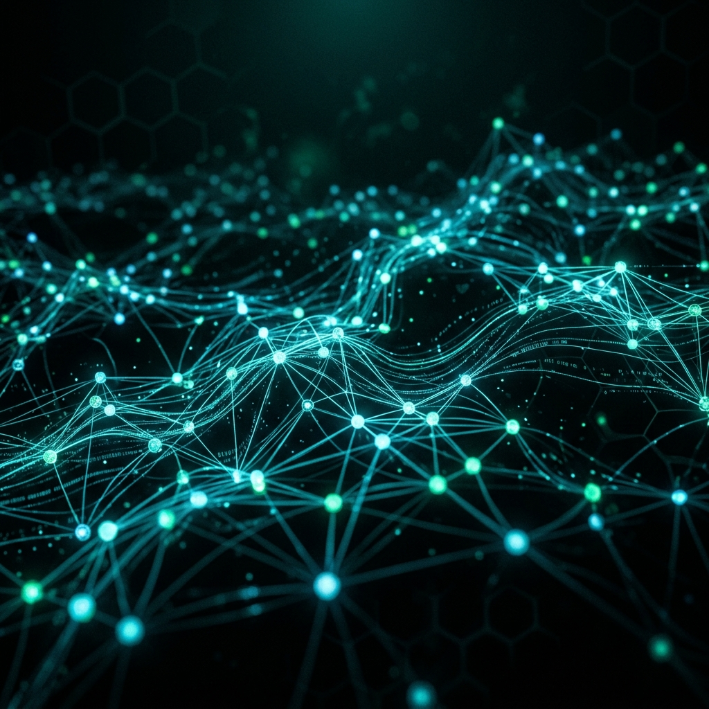

  

# 🚀 AIX - Corporate AI Command Center

  <strong>The Future of Enterprise AI Interfaces.</strong>
   
  <em>Built with Laravel, Livewire 3, Tailwind CSS & Alpine.js</em>

---

## 🌍 English

### Overview
**AIX** is an ultra-premium, cyberpunk-themed Corporate AI Hub. Designed to look and feel like a native application, it offers zero-latency SPA (Single Page Application) transitions, deep dark-mode aesthetics, and a stunning glassmorphic UI. 

### Key Features
- **Cinematic Splash Screen:** A one-time-per-session boot sequence with glowing neon glitch effects and scanner animations.
- **Glassmorphism Design:** Deep `#030a10` backgrounds with cyan/teal neon accents replacing standard flat UI.
- **Lightning Fast Navigation:** Integrated with Livewire `wire:navigate` for instant page swaps without browser reloads.
- **Custom Auth Flows:** Fully redesigned Jetstream authentication modals, forms, and views matching the futuristic theme.
- **Secure Architecture:** Built on Laravel's robust backend security and Livewire's real-time component updates.

### Installation
1. Clone the repository.
2. Run `composer install` and `npm install`.
3. Copy `.env.example` to `.env` and configure your database.
4. Run `php artisan key:generate`.
5. Run `php artisan migrate`.
6. Start the server: `php artisan serve` and `npm run dev`.

---

## 🇹🇷 Türkçe

### Genel Bakış
**AIX**, siberpunk temalı, ultra-premium bir Kurumsal Yapay Zeka Yönetim Merkezidir. Gerçek bir masaüstü/mobil uygulama hissi vermek üzere tasarlanmıştır. Sıfır gecikmeli SPA (Tek Sayfa Uygulaması) geçişleri, derin karanlık mod estetiği ve "Glassmorphism" (Cam Efekti) arayüzü ile öne çıkar.

### Öne Çıkan Özellikler
- **Sinematik Açılış Ekranı:** Oturum başına sadece bir kez çalışan, neon glitch efektli ve lazer taramalı bir sistem başlatma şovu.
- **Glassmorphism (Cam Efekti) Tasarım:** Sıkıcı düz arayüzlerin aksine; derin `#030a10` arka planlar ve parlayan "cyan/teal" neon vurgular.
- **Işık Hızında Gezinme:** Sayfa yenilenmeden anında içerik değişimi sağlayan Livewire `wire:navigate` entegrasyonu.
- **Özel Kimlik Doğrulama:** Jetstream'in tüm giriş/kayıt, profil ayarları ve modalları fütüristik temaya uygun şekilde baştan tasarlandı.
- **Güvenli Mimari:** Laravel'in güçlü altyapısı ve Livewire'ın gerçek zamanlı güncellemeleri üzerine inşa edildi.

### Kurulum
1. Repoyu klonlayın.
2. `composer install` ve `npm install` komutlarını çalıştırın.
3. `.env.example` dosyasını `.env` olarak kopyalayın ve veritabanı ayarlarını yapın.
4. `php artisan key:generate` komutunu çalıştırın.
5. `php artisan migrate` ile tabloları oluşturun.
6. Sunucuyu başlatın: `php artisan serve` ve `npm run dev`.

---

  <em>Designed for the future, built for performance.</em>

